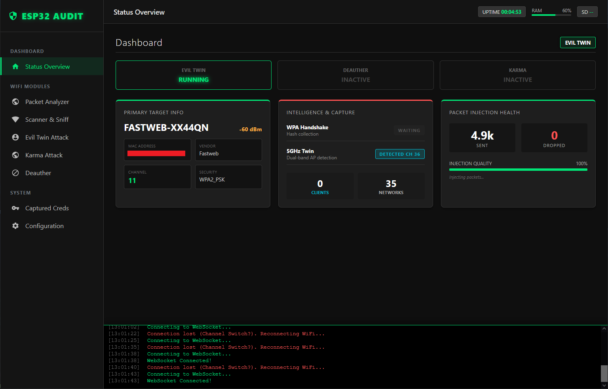
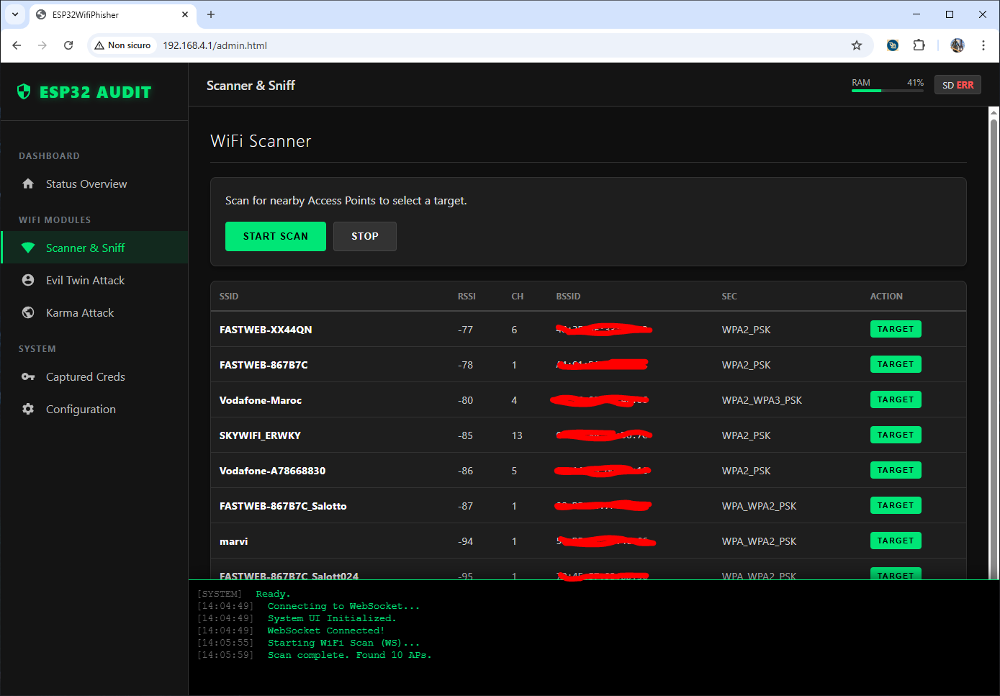
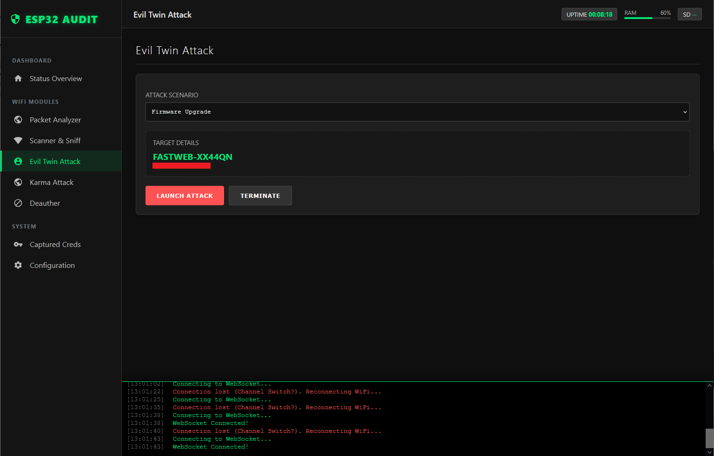
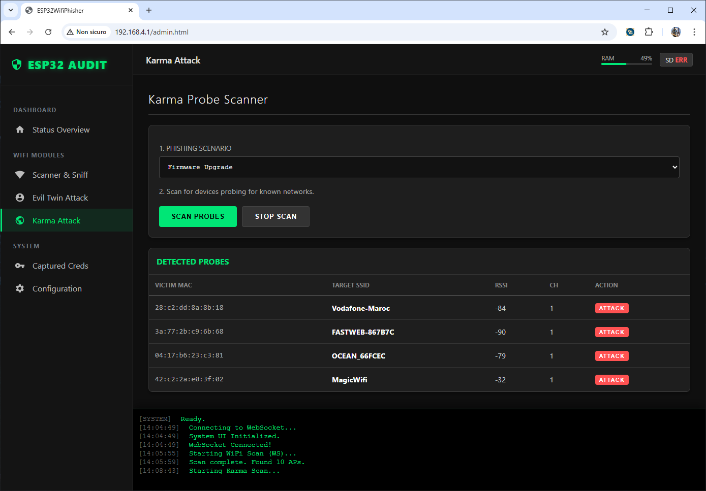
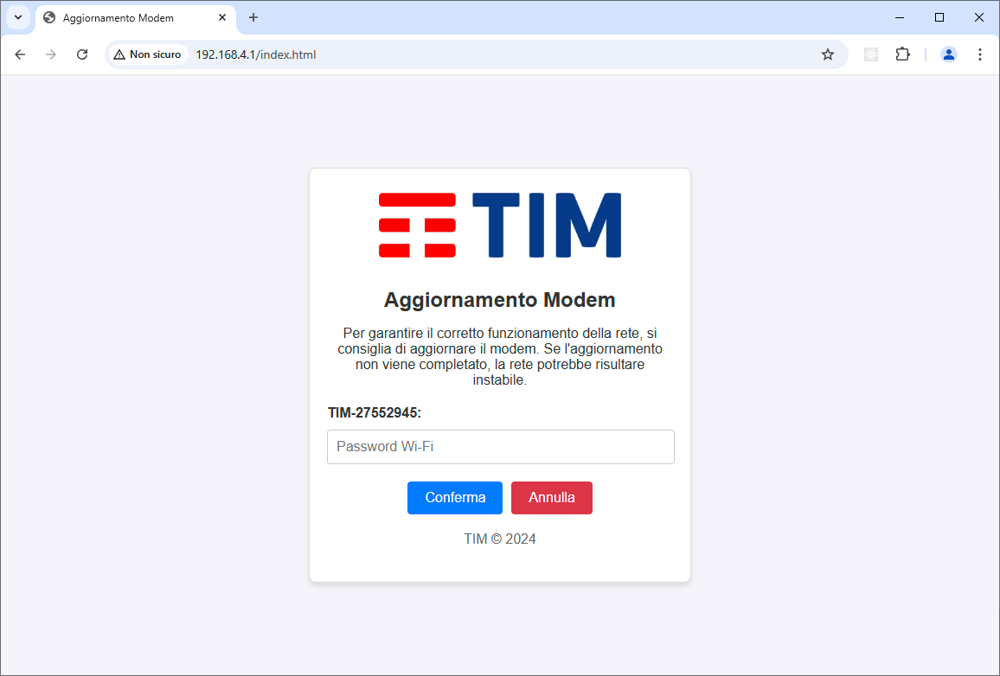

### Features

- **Aircrack**:  
Capture client handshake and check the user input password (WPA/WPA2/WPA3).

- **Evil Twin Attack**:  
Creates a rogue access point (AP) mimicking the target network, thus tricking clients into connecting to it.

- **Target Tracking**:
Target trackig is done monitoring beacon frames or by detecting CSA(Channel Switch Announcement) in Beacon/Probe Response and Action Frame.

- **Captive Portal**:  
Victims will be automatically redirected to the Captive Portal page upon connecting to the fake access point.

- **Advanced deauthentication technique**:  
Supports new advanced techniques for Wi-Fi 6 deauthentication like negative TX power constraint, EAPOL-logoff, EAP-Failure, Malformed Handshare message 1, Invalid PMKID, EAPOL Rounds and EAPOL start spamming.

- **Automatic Vendor Identification**:  
Support for vendor identification based upon SSID name and capturing beacon frame (*TO DO*).

- **Phishing Scenarios**:  
Serves customized phishing pages to capture sensitive information, such as login credentials.

- **Compact and Portable**:  
  Runs on the ESP32, making it lightweight and suitable for hardware testing scenarios.

- **Configurable via Web Interface**:  
  Allows customization of network settings and phishing scenarios through a web interface.

## To-Do List 
- [☑] Add a channel tracking functionality (some AP may switch channels)
- [☑] Add a handshake capture and basic aircrack implementation to check a user input password
- [ ] Add a telegram/email notification when password is succesfully stealed

## Flash the firmware
Use the [Online Flasher](https://espwifiphisher.alexxdal.com/) to flash your device.

# WifiPhisher for ESP32

[](https://github.com/Alexxdal/WifiPhisher)

WifiPhisher for ESP32 is a custom implementation of a phishing tool designed for the ESP32 microcontroller. It performs Evil Twin attacks, allowing users to test the security of Wi-Fi networks and execute social engineering phishing scenarios. The project is built using **PlatformIO** and the **ESP-IDF framework**.

## Requirements

### Software

- **PlatformIO**:  
  Integrated into your IDE (e.g., Visual Studio Code). [Install PlatformIO](https://platformio.org/install).

- **ESP-IDF Framework**:  
  Required for building and flashing the firmware. PlatformIO automatically configures this as part of the development environment.

---

## Installation

### 1. Clone the Repository
```bash
git clone https://github.com/Alexxdal/WifiPhisher.git
cd WifiPhisher
```

### 2. Build and Upload

Open the project with Visual Studio Code and ensure that PlatformIO is correctly set up.

1. Select your target device (e.g. esp32s3 )
2. Connect your ESP32 board to your computer via USB.
3. Click "Upload"

### 3. Monitor Logs

To debug or monitor the ESP32's output logs:
1. Use PlatformIO serial monitor:
  ```bash
   pio device monitor
   ```
2. To stop the monitor, press `Ctrl+C`.

---

## Usage

#### 1. Access Web Interface
1. Connect to the ESP32 rogue AP (default: "MagicWifi" password: "MagicWifi1234" ).
2. Open a browser and go to `http://192.168.4.1:8080/`.

#### 2. Configure the Attack
1. Select the target Wi-Fi network to impersonate.
2. Choose a phishing scenario (e.g., fake login page).

#### 3. Run the Attack
Once configured, the ESP32 will execute the Evil Twin attack and serve the phishing page.

---

## Screenshots

Here are some visual examples of the tool in action:

### 1. Dashboard


### 2. Scan & Sniff


### 3. EvilTwin Page


### 4. Karma Attack Page


### 5. Example Phishing Page


---

## Contributions

Contributions are welcome! You can improve phishing scenarios, optimize performance, or add new features.

---

## Disclaimer

This tool is intended strictly for educational purposes and ethical hacking in controlled environments. Unauthorized use of WifiPhisher for malicious purposes is illegal and punishable by law. Always ensure you have explicit permission before conducting any testing.
