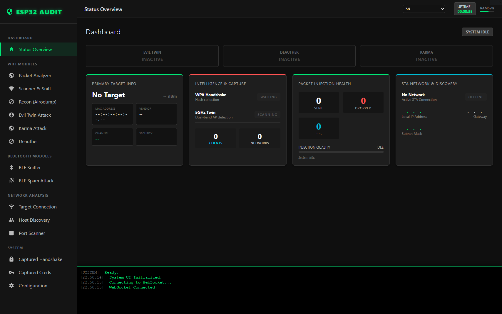
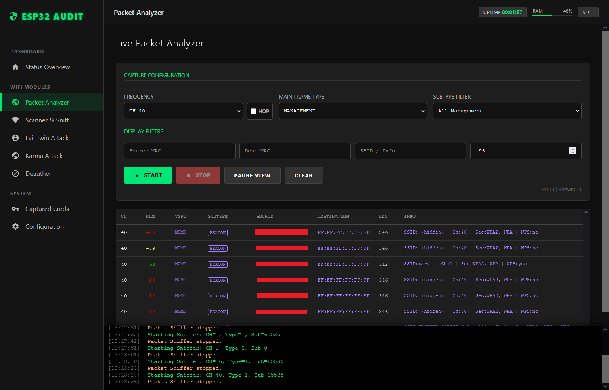
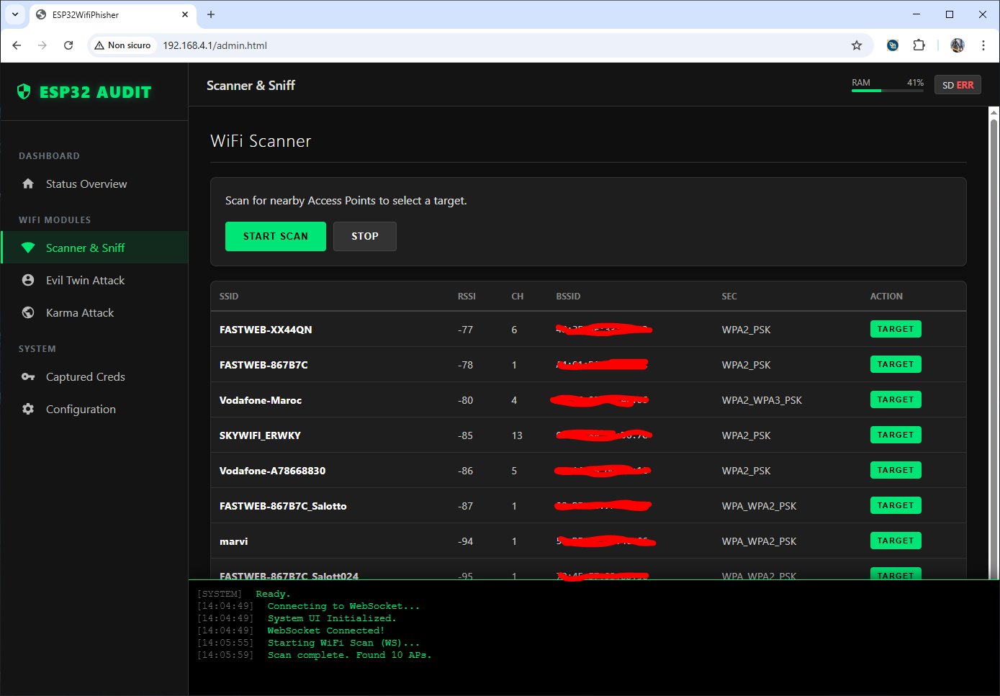
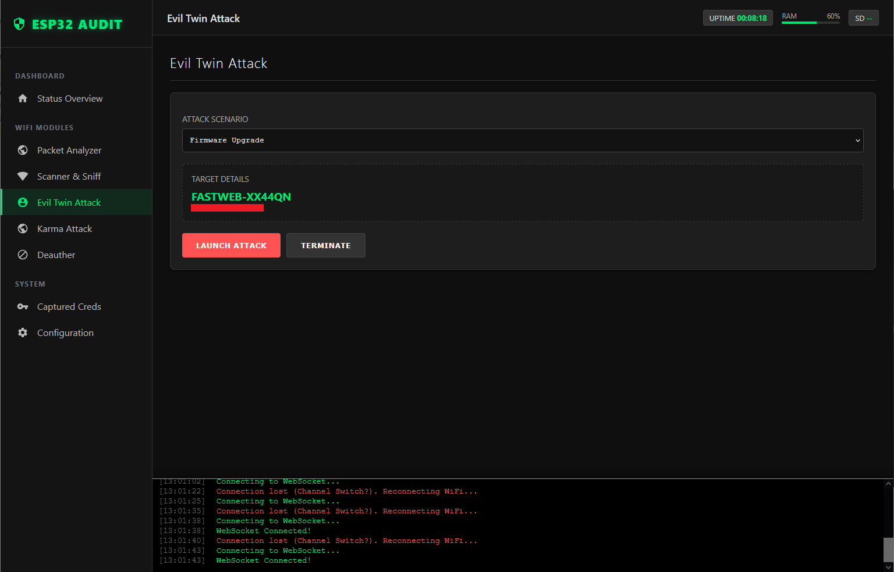
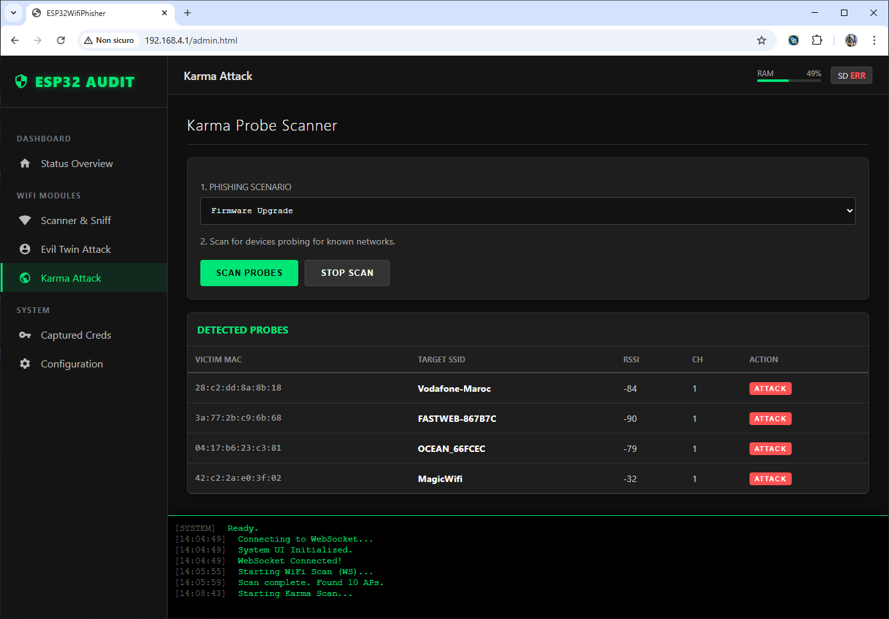
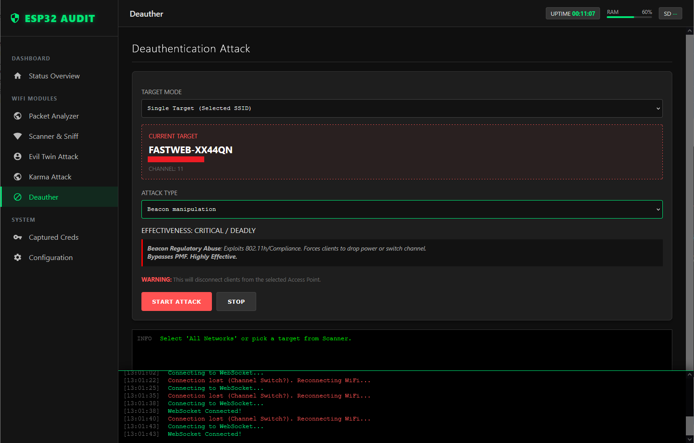
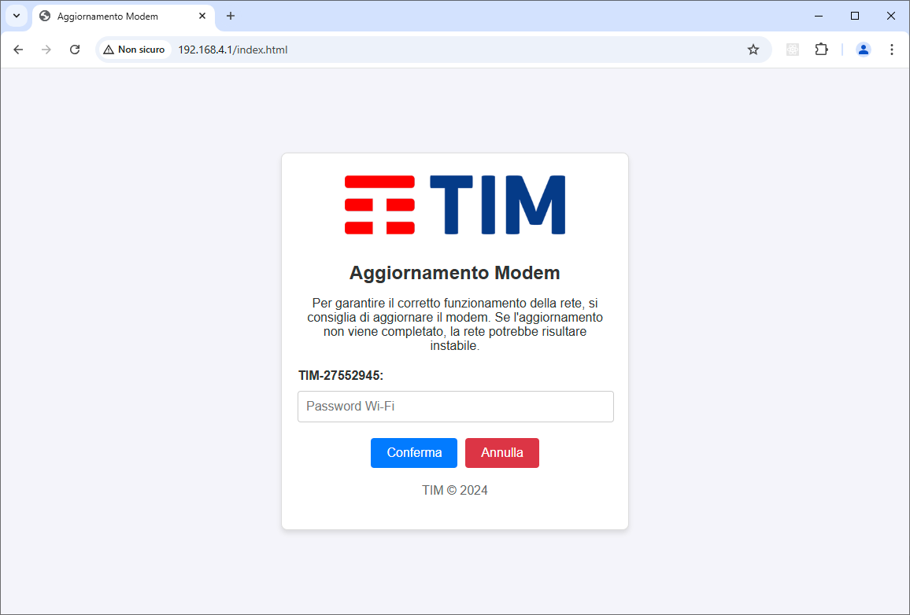

# WifiPhisher for ESP32

[](https://github.com/Alexxdal/WifiPhisher)
[](./LICENSE)
[](https://docs.espressif.com/projects/esp-idf/)
[](https://platformio.org/)

WifiPhisher for ESP32 is a custom implementation of a phishing tool designed for the ESP32 family of microcontrollers. It performs Evil Twin attacks, Karma attacks, and Wi-Fi 6 deauthentication techniques, allowing security researchers to test the resilience of Wi-Fi networks and run controlled social-engineering phishing scenarios. The project is built with **PlatformIO** on top of the **ESP-IDF framework**.

> **Legal notice:** this tool is intended strictly for educational purposes and authorized security testing. See the [Disclaimer](#disclaimer) section before use.

## Table of Contents

- [Features](#features)
- [Supported Hardware](#supported-hardware)
- [Requirements](#requirements)
- [Getting Started](#getting-started)
  - [Option A: Flash the Prebuilt Firmware](#option-a-flash-the-prebuilt-firmware-recommended)
  - [Option B: Build from Source](#option-b-build-from-source)
  - [Monitor Logs](#monitor-logs)
- [Usage](#usage)
- [Screenshots](#screenshots)
- [Roadmap](#roadmap)
- [Contributing](#contributing)
- [Further Reading](#further-reading)
- [License](#license)
- [Disclaimer](#disclaimer)

## Features

### Reconnaissance

- **Wi-Fi Packet Sniffer & Live Analyzer** — Promiscuous-mode capture with automatic channel hopping and a real-time packet analyzer streamed to the web UI, tracking nearby access points and clients (RSSI, packet/byte counters).
- **Host Discovery (Subnet Scan)** — ARP sweep of the subnet the device is connected to, listing every live host's IP address, MAC address, and hostname (when a local DNS server is reachable).
- **Port Scanner** — Probe a target host's ports using TCP Connect or TCP SYN (stealth) scanning, with presets for the top 20/50 ports, common IoT ports, or a custom port list.

### Attacks

- **Evil Twin Attack** — Create a rogue access point (AP) that mimics the target network to trick clients into connecting to it.
- **Karma Attack** — Automatically detect devices probing for known networks and send spoofed responses to lure them onto the rogue AP.
- **Deauther & Advanced Attacks** — 15 disconnection techniques ranging from classic deauth/disassociation frames to authentication/association floods, CSA channel-switch spoofing, EAPOL-Logoff and EAPOL-Start manipulation, EAP-Failure injection, WPA3 SAE-flood, PMF downgrade pressure, and beacon spam.
- **Aircrack** — Capture a client's WPA/WPA2/WPA3 4-way handshake or PMKID and verify a candidate password against it, entirely on-device.

### Phishing & Data Capture

- **Multiple Phishing Scenarios** — Serve an OS-native captive-portal login prompt, a fake router firmware-update page, a fake plugin/software-update page, a fake OAuth/social login page, or an ISP-branded login page auto-matched from the target SSID.
- **Captured Credentials Log** — Every submitted phishing form is saved on-device and can be reviewed or exported from the admin dashboard.
- **Handshake / PMKID Export** — Download any captured handshake (or PMKID-only capture) as a ready-to-use `.pcap` file, compatible with aircrack-ng and hashcat, directly from the web UI.

### Quality of Life

- **Persistent Configuration** — AP SSID/password/channel/TX rate and the last-used Wi-Fi credentials are stored in flash and restored after reboot.
- **Multi-language Web UI** — Admin dashboard and captive portal available in Italian, English, French, German, Spanish, Russian, and Chinese.

## Supported Hardware

The firmware is built per-target with PlatformIO. Pick the environment that matches your board:

| PlatformIO environment | Board / chip           |
|-------------------------|------------------------|
| `esp32`                 | ESP32 (esp32dev)       |
| `esp32s2`                | ESP32-S2               |
| `esp32s3`                | ESP32-S3                |
| `esp32c3`                | ESP32-C3                |
| `esp32c5`                | ESP32-C5                |
| `esp32c6`                | ESP32-C6                |
| `cardputer`              | M5Stack Cardputer (ESP32-S3) |

## Requirements

### Software

- **PlatformIO** — integrated into your IDE (e.g. Visual Studio Code). [Install PlatformIO](https://platformio.org/install).
- **ESP-IDF Framework** — required to build and flash the firmware; PlatformIO configures this automatically as part of the project environment.

### Hardware

- One of the [supported ESP32 boards](#supported-hardware) above.
- A USB cable for flashing and serial monitoring.

## Getting Started

### Option A: Flash the Prebuilt Firmware (Recommended)

The fastest way to get started: use the [Online Flasher](https://espwifiphisher.alexxdal.com/) to flash your device directly from the browser — no build tools required.

### Option B: Build from Source

1. **Clone the repository**

   ```bash
   git clone https://github.com/Alexxdal/WifiPhisher.git
   cd WifiPhisher
   ```

2. **Build and upload**

   Open the project in Visual Studio Code and make sure PlatformIO is correctly set up.

   1. Select your target environment (e.g. `esp32s3`) from the PlatformIO toolbar.
   2. Connect your ESP32 board to your computer via USB.
   3. Click **General->Upload**.
   4. Click **Platform->Upload Filesystem Image**

### Monitor Logs

To debug or monitor the ESP32's serial output:

```bash
pio device monitor
```

Press `Ctrl+C` to stop the monitor.

## Usage

1. **Access the web interface**
   1. Connect to the ESP32's rogue AP (default SSID: `MagicWifi`, password: `MagicWifi1234`).
   2. Open a browser and go to `http://192.168.4.1/admin.html`.

2. **Configure the attack**
   1. Select the target Wi-Fi network to impersonate.
   2. Choose a phishing scenario: OS-native captive portal, fake firmware update, fake plugin update, fake OAuth login, or the auto-matched ISP-branded login page.

3. **Run the attack**

   Once configured, the ESP32 executes the Evil Twin attack and serves the phishing page.

## Screenshots

| | |
|---|---|
| **Status Overview**<br> | **Packet Analyzer**<br> |
| **Scan**<br> | **Evil Twin Attack**<br> |
| **Karma Attack**<br> | **Deauther**<br> |
| **Example Phishing Page**<br> | |

## Roadmap

Ideas being considered for future releases:

- **Complete the Port Scanner** — implement the FIN, NULL, XMAS, ACK, and UDP scan methods already selectable in the UI (currently only TCP Connect and TCP SYN are functional).
- **Session Reports** — export a single JSON/PDF summary of a test session (discovered hosts, open ports, captured handshakes, harvested credentials) instead of pulling each result separately.
- **Customizable Phishing Templates** — allow uploading a custom logo/template from the web UI instead of relying only on the built-in ISP-branded pages.

## Contributing

Contributions are welcome! Feel free to open an issue or a pull request to improve phishing scenarios, optimize performance, add support for new hardware, or add new features.

## Further Reading

Background research that informed this project:

- Schepers, D., Ranganathan, A., & Vanhoef, M. (2022). [*On the Robustness of Wi-Fi Deauthentication Countermeasures*](./doc/wisec2022.pdf). WiSec '22.
- Cayre, R., Cauquil, D., & Francillon, A. (2023). [*ESPwn32: Hacking with ESP32 System-on-Chips*](./doc/woot23-paper22.pdf). WOOT '23.

## License

This project is licensed under the [MIT License](./LICENSE).

## Disclaimer

This tool is intended strictly for educational purposes and ethical hacking in controlled environments. Unauthorized use of WifiPhisher for malicious purposes is illegal and punishable by law. Always ensure you have explicit permission before conducting any testing.